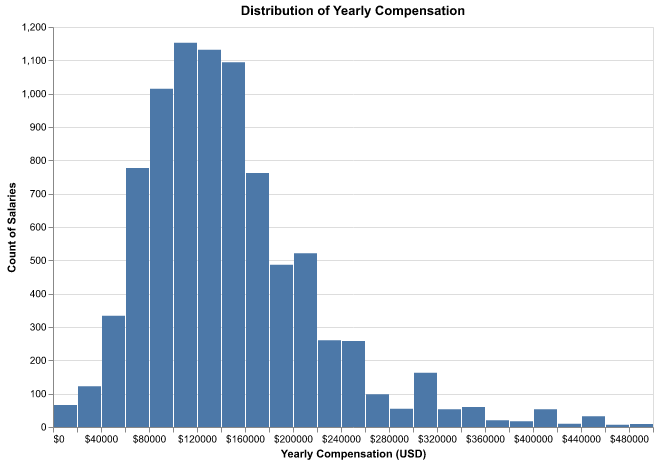
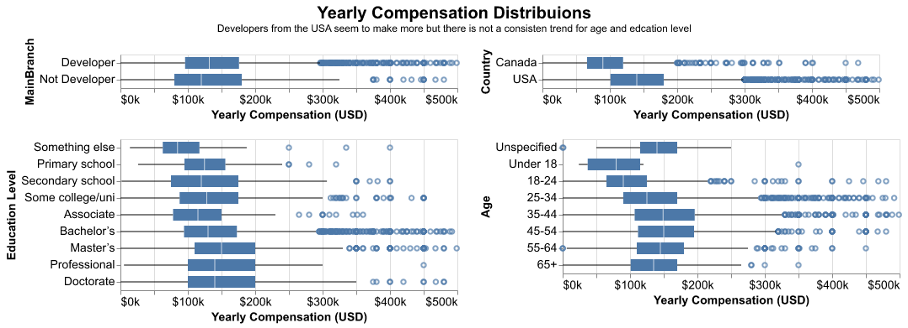

```{r setup, include=FALSE}
knitr::opts_chunk$set(echo = FALSE)
library(tidyverse)
library(knitr)
library(kableExtra)
```

# Summary

By this point we have all heard how data-related jobs are the talk of the town and by just learning to code you could be raking in a 6-figure salary in no time. But aside from all the hype and click bait news articles, is it possible to predict how much compensation you can expect given your experience and other related factors? As current budding data scientists our group is very interested in this question. Using the latest release of the Stack overflow Annual Developers Survey, we set out to build a machine learning model to predict the total yearly compensation for data-related jobs.

After conducting pre-processing and a quick feature selection pipeline, we decided to use a Random Forrest Regressor as our final model. Once hyperparameter tuning was completed, our model yielded a mean $R^2$ score of 0.27 on unseen training data. Although the model did not preform as well as we had hoped, it still did better than the Dummy Regressor! As this was our first attempt at answering this question and the data set we chose ended up being very difficult to work with given the way data was recorded from the survey, we all agree that this was a good staring point and that results could be improved with some focused feature engineering. Also, as this project is fully reproducible, feel free to copy the repo and give it a try yourself!

# Introduction

As we are all current students in the MDS program, a question we have is: where will we end up working after this program is over?? A natural follow up question to this is, how much can we expect to be compensated given our previous experience, target industry, geographic location, etc. Wouldn't it be nice if we could create some sort of model that would help us gain insight into this question? Is there anything we have learnt so far in our program that could shed some light on this conundrum? Well, you have come to the right place! Our group has found a recent and comprehensive dataset processed from the Stack overflow Annual Developers Survey which we will use to build a predictive machine learning model to help answer this burning question that is on our and the rest of our cohort's mind! Read on for a breakdown of our question and an overview of our approach.

# Data Preprocessing

## Dataset

The dataset used for this prediction model building of Data Science Salary Predictor is from 2022 Stack Overflow Annual Developer Survey, can be obtained from links below:

[Dataset download page](https://insights.stackoverflow.com/survey)

[Download dataset directly to your local](https://info.stackoverflowsolutions.com/rs/719-EMH-566/images/stack-overflow-developer-survey-2022.zip)

The overall survey features over 70,000 responses fielded from over 180 countries, examining all aspects of the developer experience from learning to code to favorite technologies for version control and workplace experience.

A detailed summary of the overall dataset can be found [here](https://survey.stackoverflow.co/2022/)

Each row in the data set represents the survey response of an individual working in a data-related career including information on skills, experience, technologies worked with, and demographics.

Since we are interested in developing a predictor for North American Data Science Salaries, the dataset was subset to only include responses from individuals in Canada and the United States as a proxy for the whole of North America as the bulk of the responses are from these two countries.

Also by limiting the salary range with \$500k, making the predictor more reliable for the majority of the Data Science community.

## Feature Descriptions

The full feature description schema can be found [here](../data/raw/survey_results_schema.csv).

Below are the descriptions based on the types of features, which are used for data pre-processing:

### Numeric Features

`YearsCode`: Including any education, how many years have you been coding in total? Range from 0 year to over 50 years

`YearsCodePro`: NOT including education, how many years have you coded professionally (as a part of your work)? Range from 0 year to over 50 years

`WorkExp`: How many years of working experience do you have? Range from 0 year to over 50 years

### Categorical Features

`OrgSize`: Approximately how many people are employed by the company or organization you currently work for?

9 unique values ['20 to 99 employees', '1,000 to 4,999 employees', '500 to 999 employees', '10,000 or more employees', '5,000 to 9,999 employees', 'Just me - I am a freelancer, sole proprietor, etc.', '2 to 9 employees', '100 to 499 employees', '10 to 19 employees', 'I don't know'],

`RemoteWork`: Which best describes your current work situation?

3 unique values ['Fully remote', 'Hybrid (some remote, some in-person)', 'Full in-person']

#### Binary Features

`MainBranch`: Which of the following options best describes you today? Here, by "developer" we mean "someone who writes code."

1 = 'I am not primarily a developer, but I write code sometimes as part of my work', 0 = 'I am a developer by profession'

`Country`:Where do you live?

1 = 'United States of America', 0 = 'Canada'

### Oridinal Features

`EdLevel`: Which of the following best describes the highest level of formal education that you've completed? \*

Following the order below with assigned value form 0 to 8

['Something else', 'Primary/elementary school', 'Secondary school (e.g. American high school, German Realschule or Gymnasium, etc.)','Some college/university study without earning a degree', 'Associate degree (A.A., A.S., etc.)', "Bachelor's degree (B.A., B.S., B.Eng., etc.)", "Master's degree (M.A., M.S., M.Eng., MBA, etc.)",'Professional degree (JD, MD, etc.)', 'Other doctoral degree (Ph.D., Ed.D., etc.)']

`Age`: What is your age?

Following the order below with assigned value form 0 to 7

['Prefer not to say', 'Under 18 years old', '18-24 years old','25-34 years old','35-44 years old','45-54 years old', '55-64 years old','65 years or older']

### Multi-selection question features

`DevType`: Which of the following describes your current job? Please select all that apply.

`LanguageHaveWorkedWith`: Which programming, scripting, and markup languages have you done extensive development work in over the past year, and which do you want to work in over the next year?

`DatabaseHaveWorkedWith`: Which database environments have you done extensive development work in over the past year, and which do you want to work in over the next year?

`PlatformHaveWorkedWith`: Which cloud platforms have you done extensive development work in over the past year, and which do you want to work in over the next year?

`WebframeHaveWorkedWith`: Which web frameworks and web technologies have you done extensive development work in over the past year, and which do you want to work in over the next year?

`MiscTechHaveWorkedWith`: Which other frameworks and libraries have you done extensive development work in over the past year, and which do you want to work in over the next year?

`ToolsTechHaveWorkedWith`: Which developer tools have you done extensive development work in over the past year, and which do you want to work in over the next year?

`NEWCollabToolsHaveWorkedWith`: Which development environmentsdid you use regularly over the past year, and which do you want to work with over the next year?

`OpSysProfessional use`: What is the primary operating system in which you work?

`VCInteraction`: How do you interact with your version control system? Select all that apply.

`VersionControlSystem`: What are the primary version control systems you use?

`OfficeStackAsyncHaveWorkedWith`: Which collaborative work management toolsdid you use regularly over the past year, and which do you want to w ork with over the next year?

`Employment`: Which of the following best describes your current employment status?

## Preprocessing Data

The Data was first filter by country, job type and converted compensation.

Then it is imputed to fill the missing values.

The train split will be 90% of the overall filtered data and test splits will be 10% of the overall filtered data.

The by defining the column transformer for different types of features, the train split was encoded for EDA use, which will be explained in the next section.

# Analysis

#### EDA

There are 8,558 observations of survey responses in our filtered and encoded dataset with no missing values in any rows or columns.

We have 266 usable features in total after preprocessing and transforming our initial dataset. Our target column is `ConvertedCompYearly` that shows the yearly compensation that was reported by each individual responded converted into \$USD.

Below is the distribution of our target column, which rightly skewed.

```{r out.width="60%", out.height="60%", fig.align='center', fig.cap="Figure 1. Distribution of Yearly Compensation"}

```

There are a few categorical features that were of interest to us, including Main Branch, Country, Education Level and Age so we examined their distributions via boxplots. Based on the figures below we can see that developers in the USA tend to make more on average than those in Canada, with age and education level not showing any consistent trends.

```{r out.width="100%", fig.align='center', fig.cap="Figure 2. Distribution of Yearly Compensation for Key Categorical Features"}

```

We also examined the correlation between a few numeric features of interest including YearsCode, YearsCodePro and WorkExp with our target ConvertedCompYearly. Below is the correlation matrix for our key numeric features. We see a modest correlation between years spent coding, both overall and professionally, with yearly compensation.

```{r fig.align='center'}
kable(read.csv("results/correlation_table.csv"),
      caption = "**Table 1.** Correlation Matrix of Key Numeric Features") %>%
  kable_styling(full_width = F, font_size = 10) %>%
  kable_classic_2(full_width = F) %>%
  scroll_box(width = "100%", height = "200px")
```

# Model Selection

The final model would be able to predict the Data Science yearly converted salary when giving new data point representing a North American (Canada or US) Data Science related job.

The following models were used for evaluation through cross validation by using the train split data, along with the designated proprocessor:

-   DummyRegressor
-   KNeighborsRegressor
-   Ridge
-   RandomForestRegressor
-   Lasso

The result decision was based on the mean R2 score from the cross validation. The result can be see below:

```{r fig.align='center'}
kable(read.csv("results/model_accuracies.csv"),
      caption = "Table 2. Cross Validation results for different models") %>%
  kable_styling(full_width = F, font_size = 10) %>%
  kable_classic_2(full_width = F) %>%
  scroll_box(width = "100%", height = "200px")
```

And the RandomForestRegressor gives the highest R2 validation score of around 0.32, thus RandomForestRegressor will be used for the upcoming hyperparameter tuning and final model building.

## Feature Selection

By using Ridge we are able to select 105 features, but the cross-validation accuracy reduces to about 0.27.

```{r fig.align='center'}
kable(read.csv("results/rf_result_with_feature_selection.csv"),
      caption = "Table 3. Cross Validation results for random forest with selected features") %>%
  kable_styling(full_width = F, font_size = 10) %>%
  kable_classic_2(full_width = F) %>%
  scroll_box(width = "100%", height = "200px")
```

## Hyper-parameter tuning

By using the RandomizedSearchCV, the best model is selection based on best score and best parameters as below:

```{r fig.align='center'}
kable(read.csv("results/best_params.csv"),
      caption = "Table 4. Best Parameters for random forest") %>%
  kable_styling(full_width = F, font_size = 10) %>%
  kable_classic_2(full_width = F) %>%
  scroll_box(width = "100%", height = "200px")
```

```{r fig.align='center'}
kable(read.csv("results/validation_score.csv"),
      caption = "Table 5. Validation score for random forest") %>%
  kable_styling(full_width = F, font_size = 10) %>%
  kable_classic_2(full_width = F) %>%
  scroll_box(width = "100%", height = "200px")
```

As we can see, there is an improvement of about 1% in the R2.

## Final model building

By using the best model with the best hyperparameter as mentioned above, the model score against the test data is shown in Table 6

```{r fig.align='center'}
kable(read.csv("results/test_score.csv"),
      caption = "Table 6. Test Score") %>%
  kable_styling(full_width = F, font_size = 10) %>%
  kable_classic_2(full_width = F) %>%
  scroll_box(width = "100%", height = "200px")
```

As the result on unseen data is better than the cross validation score, the final model is generalizing well.

# Further Improvements

1.  Feature engineering and importance analysis can help to reduce the impact from any noise feature. Removing those noise features can be done based on the correlation with the target feature, which is the converted yearly compensation.

2.  For those feature containing null values or values as 'unspecified', if there is a better way to make those values can be more meaningful, it would be helpful to improve the overall model performance.

3.  For regression problems, it is necessary to have more data points. The solution could be to include more survey entries from recent years, not only 2022. This could make the prediction accuracy higher.

Final report was build by using the following software or libraries:\
- R [@R],\
- Rmarkdown [@Rrmarkdown],\
- Knitr [@knitr],\
- kableExtra [@kableextra],\
- tidyverse [@tidy]\
- Python [@python]\
- pandas[@pandas],\
- numpy[@numpy],\
- scikit-learn[@scikit-learn],\
- altair[@altair],\

# References
